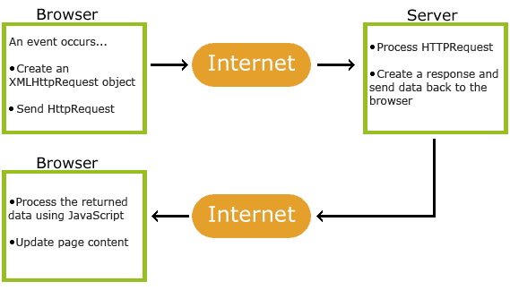

## jQuery Syntax

The jQuery syntax is tailor-made for selecting HTML elements and performing some action on the element(s).

Basic syntax is: $(selector).action()

A $ sign to define/access jQuery
A (selector) to "query (or find)" HTML elements
A jQuery action() to be performed on the element(s)

Examples:

```
$(this).hide() - hides the current element.
$("p").hide() - hides all <p> elements.
$(".test").hide() - hides all elements with class="test".
$("#test").hide() - hides the element with id="test".
```

## jQuery Selectors

jQuery selectors allow you to select and manipulate HTML element(s).

## The element Selector

The jQuery element selector selects elements based on the element name.

You can select all <p> elements on a page like this:

```
$("p")
```

When a user clicks on a button, all <p> elements will be hidden:

Example

```
$(document).ready(function(){
  $("button").click(function(){
    $("p").hide();
  });
});
```

## The #id Selector

The jQuery #id selector uses the id attribute of an HTML tag to find the specific element.

An id should be unique within a page, so you should use the #id selector when you want to find a single, unique element.

To find an element with a specific id, write a hash character, followed by the id of the HTML element:

```
$("#test")
```

When a user clicks on a button, the element with id="test" will be hidden:

Example

```
$(document).ready(function(){
  $("button").click(function(){
    $("#test").hide();
  });
});
```

## The .class Selector

The jQuery .class selector finds elements with a specific class.

To find elements with a specific class, write a period character, followed by the name of the class:

```
$(".test")
```

When a user clicks on a button, the elements with class="test" will be hidden:

Example

```
$(document).ready(function(){
  $("button").click(function(){
    $(".test").hide();
  });
});
```

## jQuery Event Methods

What are Events?
All the different visitors' actions that a web page can respond to are called events.

An event represents the precise moment when something happens.

Examples:
moving a mouse over an element
selecting a radio button
clicking on an element
The term "fires/fired" is often used with events. Example: "The keypress event is fired, the moment you press a key".

## jQuery Syntax For Event Methods

In jQuery, most DOM events have an equivalent jQuery method.

To assign a click event to all paragraphs on a page, you can do this:

```
$("p").click();
```

The next step is to define what should happen when the event fires. You must pass a function to the event:

```
$("p").click(function(){
  // action goes here!!
});
```

## AJAX basic

AJAX is a developer's dream, because you can:

Update a web page without reloading the page
Request data from a server - after the page has loaded
Receive data from a server - after the page has loaded
Send data to a server - in the background

AJAX = Asynchronous JavaScript And XML.

AJAX is not a programming language.

AJAX just uses a combination of:

A browser built-in XMLHttpRequest object (to request data from a web server)
JavaScript and HTML DOM (to display or use the data)



1. An event occurs in a web page (the page is loaded, a button is clicked)
2. An XMLHttpRequest object is created by JavaScript
3. The XMLHttpRequest object sends a request to a web server
4. The server processes the request
5. The server sends a response back to the web page
6. The response is read by JavaScript
7. Proper action (like page update) is performed by JavaScript`

Example

```
<!DOCTYPE html>
<html>
<head>
<script src="https://ajax.googleapis.com/ajax/libs/jquery/3.7.1/jquery.min.js"></script>
<script>
$(document).ready(function(){
  $("button").click(function(){
    $.ajax({url: "demo_test.txt", success: function(result){
      $("#div1").html(result);
    }});
  });
});
</script>
</head>
<body>

<div id="div1"><h2>Let jQuery AJAX Change This Text</h2></div>

<button>Get External Content</button>

</body>
</html>
```

Syntax

```
$.ajax({name:value, name:value, ... })
```

The parameters specifies one or more name/value pairs for the AJAX request.

## prop() Method

Definition and Usage
The prop() method sets or returns properties and values of the selected elements.

When this method is used to return the property value, it returns the value of the FIRST matched element.

When this method is used to set property values, it sets one or more property/value pairs for the set of matched elements.

Note: The prop() method should be used to retrieve property values, e.g. DOM properties (like tagName, nodeName, defaultChecked) or your own custom made properties.

Tip: To retrieve HTML attributes, use the attr() method instead.

Tip: To remove a property use the removeProp() method.

Syntax

```
Return the value of a property:

$(selector).prop(property)
Set the property and value:

$(selector).prop(property,value)
Set property and value using a function:

$(selector).prop(property,function(index,currentvalue))
Set multiple properties and values:

$(selector).prop({property:value, property:value,...})
```

Parameter Description
property Specifies the name of the property
value Specifies the value of the property
function(index,currentvalue) Specifies a function that returns the property value to set
index - Receives the index position of the element in the set
currentvalue - Receives the current property value of selected elements
